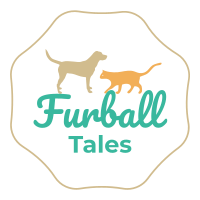

# Furball Tales

Welcome to our app "Furball Tales" 🦮 🐈

The One Stop App for Furball Parents

You can download and use Furball Tales from the [Google Play Store](https://play.google.com/store/apps/details?id=com.furballtales.furballTalesApp)

# About

Our app Furball Tales manages all of the medical information for your pet. That includes Calendar events, food tracking, various measurements like weight, walk details, and of course, vaccinations. You can also leave memos and get reminders for upcoming vet appointments. It keeps track of this stuff so you don’t have to. 

The app is also completely free with no in-app purchases or ads.

## The Team

- [Jimmy Wilson](https://github.com/jimmytwilson) - Full Stack Engineer (Tech Lead)
- [Yuta Nomoto](https://github.com/namitry) - Full Stack Engineer
- [Ayumi Funaki](https://github.com/Ayumi426) - Full Stack Engineer
- [Mukhtar Otarbayev](https://github.com/MukhtarKaz) - Full Stack Engineer
- [Ryohei Mizuho](https://github.com/Ryohei03) - Full Stack Engineer

